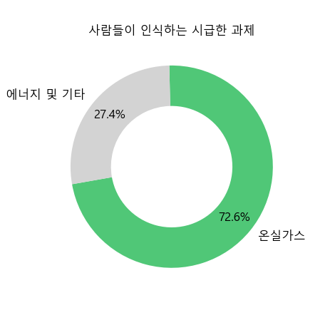
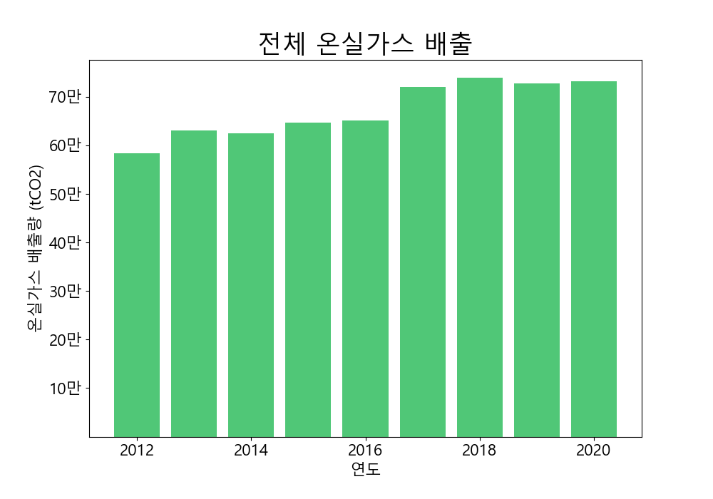
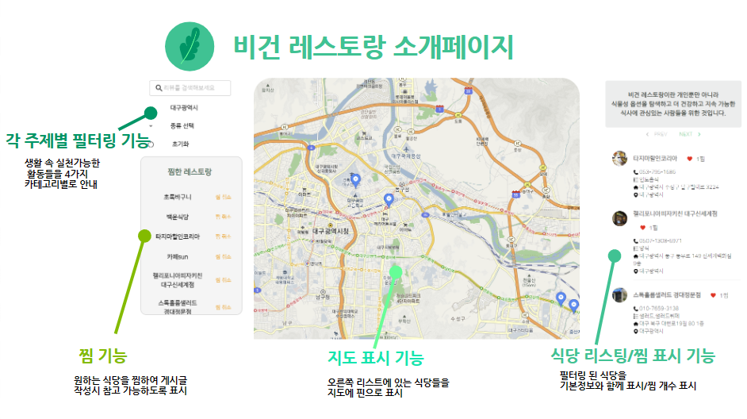
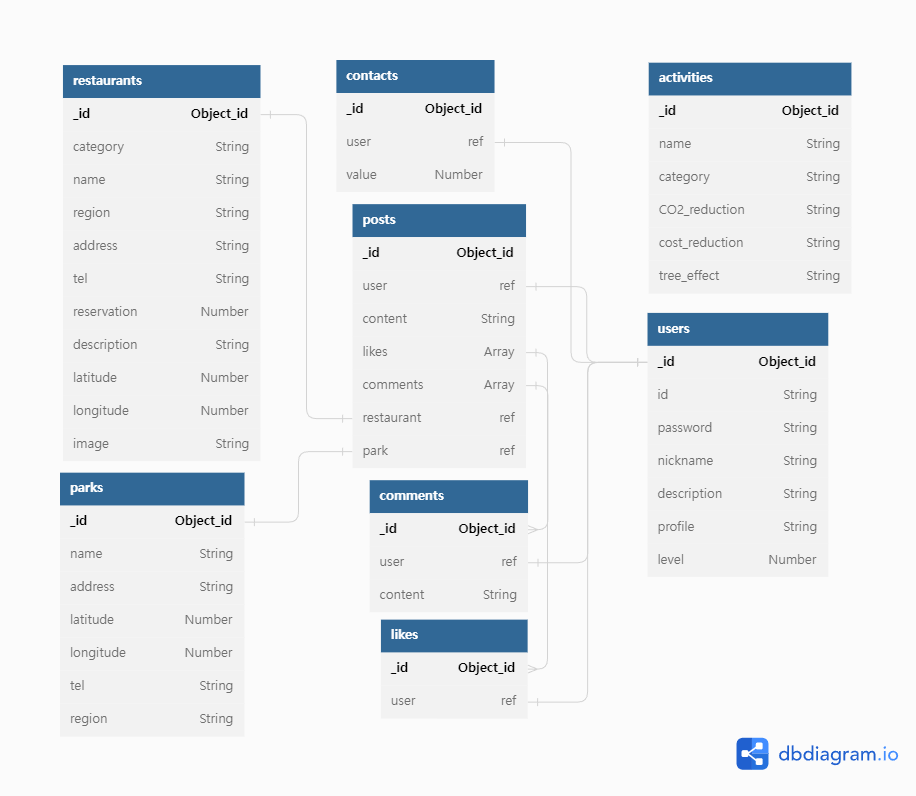

Elice AI 7기 데이터 분석 프로젝트 2팀 ENV README파일 입니다.

[[_TOC_]]

## 1. 프로젝트명
GreenLife
## 2. 프로젝트 기간/구성원
프로젝트 기간 : 2023-05-29~2023-05-17   
프로젝트 구성원 : 서원준 구병주 송민경 이혜연 김지우
## 3. 프로젝트 소개
### 3-1. 프로젝트 접속 링크
[배포 URL](http://34.64.46.75/)   
[최종발표 자료 PPT](https://docs.google.com/presentation/d/1YV54l6qapQ-uVYCQ_cNOaFk39PTqGaLT6Gby0W56l7Q/edit#slide=id.p)   
### 3-2. 개발동기
- 엘리스 AI트랙 7기 데이터 분석 프로젝트의 주제인 "환경" 관련 데이터를 수집하고 개발을 계획하고자 하였습니다. 온실가스의 주된 원인이 육류 소비량이 매년 증가하는 데이터셋을 보고, 일상 속에서 온실가스 감소를 실천할 수 있는 사이트를 개발하고자 했습니다. Green Life는 육류 소비량 감소를 위한 비건 레스토랑과 도심 속 친환경적인 공원을 소개해주고 SNS 기능을 통해 타인과 공유할 수 있는 웹 사이트입니다.
### 3-3. 데이터 분석   
[데이터분석 노션 정리](https://fuchsia-meal-e65.notion.site/5d857bb39ab647c7a954de21e21b3603)
- 데이터셋

| 데이터 결과 | 데이터 분석 |
| ------ | ------ |
|  | 일반 국민 78.6%가 환경문제에 관심을 가지고 있습니다. |
|  | 환경 문제 중에서도 온실가스와 관련된 문제를 가장 시급한 과제로 생각하는 것을 알 수 있습니다. |
|  | 환경에 대한 관심과는 다르게 온실가스 배출량이 증가하는 추세를 가집니다. |
|  | 온실가스 배출에 가장 많은 영향을 끼치는 음식이 육류라는 사실을 알 수 있습니다. |
|  | 육류 소비량이 지속적으로 증가하는 추세이며 환경 오염에 영향을 미칠 것이라는 예상을 할 수 있습니다. |

- 기대효과
   
식단에 따라 탄소 배출량이 다른 모습을 확인 할 수 있습니다. 육류를 소비하지 않는 사람들은 고기를 좋아하는 사람들에 비해 탄소 배출량을 1.4t CO2를 줄일 수 있습니다. 엄격한 채식주의자는 고기를 좋아하는 사람들에 비해 탄소 배출을 절반 정도 줄일 수 있습니다. 이러한 결과로, 육류 소비를 줄이면 탄소 배출량을 감소 시키는데 도움이 된다는 인사이트를 얻게 되었습니다.

### 3-4. 서비스 소개   
- 지속 가능한 미래를 위해 일상 속에서 온실가스 배출을 줄이는 작은 실천을 권장합니다.        
- restaurant: 카테고리와 지역 별 비건 식당을 소개해줍니다.    
- park: 지역 별 공원을 소개합니다.         
- activity: 카테고리 별로 일상 생활에서 탄소 배출을 감소시킬 수 있는 다양한 방법 안내합니다.   
- share: 일상 속에서 환경 보호 활동을 기록하고 공유하는 기능입니다.    
### 3-5. 기능 소개   
- restaurant, park
   - 각 지역별, 카테고리별 비건 레스토랑 필터링 기능   
   - 각 지역별 공원 필터링 기능   
   - 지도 및 로드뷰 표시 기능   
   - 리스팅 기능 
   - 페이지네이션    

- activity   
   - 각 주제별 필터링 기능   
   - autoplay 기능   
   - autoplay 온/오프 기능  

- share   
   - 로그인, 회원가입 기능   
   - 게시글 및 댓글 crud 기능   
   - 마이페이지 기능   
   - 유저 닉네임, 프로필 사진 변경 기능      
   - 작성 게시글, 댓글 확인 기능   
   - 좋아요 기능

  
**마이페이지 추가 예정** 
- 미디어쿼리
   - 미디어쿼리 기능
 
## 4. 개발과정 
### 4-1. 기술스택   
프론트 **추가 예정**   
   
백엔드 **추가 예정**   
   
데이터 분석   
        
### 4-2. 와이어프레임
기획과정에서는 목업 디자인을 통해 소통하였고 이후 와이어 프레임을 작성하여 개발에 착수하였습니다.   
[와이어프레임](https://xd.adobe.com/view/672ce88a-8786-4a7d-bcaa-ab4c4a3ebc46-327f/)   

### 4-3. ERD
dbdiagram을 활용하여 ERD를 작성하였습니다.

### 4-4. API명세   
Postman을 사용하여 API설계를 하였으며 mockAPI를 활용하여 프론트엔드 작업이 원활히 수행되도록 하였습니다.   
[포스트맨 링크](https://www.postman.com/orange-shuttle-369216/workspace/green-life/collection/26777273-a3c20701-96de-4bc9-a9d7-728698261c61?action=share&creator=26777273)   

### 4-5. 시스템 아키텍쳐

## 5. 협업과정
### 5-1.일정관리
Gitlab의 Issues와 Milestone기능을 활용하여 프로젝트 일정 관리를 했습니다.    
개발 단위의 우선순위를 매겨 총 4단계의 스프린트의 수행 날짜를 정하였습니다.    
각 스프린트를 마무리 한 후 다음 스프린트로 넘어 갈 수 있도록 하였고 스프린트별로 수행 해야 하는 이슈를 라벨을 활용해 구분하여 매일 해당 작업자가 진행 상황을 업데이트 하였습니다. 

   
### 5-2.개발 타임라인
|구분|일자|진행목록|비고|
|----|----|----|----|
|기획/데이터분석 단계|2023.05.29-2023.06.02|1. 주제선정   2. 데이터셋 선정 및 분석   3. 개발 일정/범위 회의||
|1차 스프린트 (기본 구성 및 리스트 추천 기능)|2023.06.01-2023.06.07|1. Repository 생성 및 기본 세팅 2. 홈화면 구현 3. 식당 페이지 구현(지도/검색/상세페이지) 4. 공원 페이지 구현 5. 비전 페이지 구현 6. 각 페이지 디자인 마무리 7. 1차 스프린트 작업 배포 및 테스트||
|2차 스프린트 (활동 소개 기능)|2023.06.07-2023.06.09|1. 활동 정보 조사 2. 활동 소개 페이지 구현 3. 필터링 기능 구현 4. 오토플레이 기능 구현 5. 전체 디자인 구성 작업 6. 2차 스프린트 작업 배포 및 테스트||
|3차 스프린트 (SNS 기능)|2023.06.09-2023.06.14|1. SNS기능 구성 회의 2. 회원가입/로그인 기능 구현 3. 게시글 CRUD 구현 4. 댓글 CRUD 구현 5. 좋아요 기능 구현 6. 반응형 디자인 적용 완료||
|4차 스프린트 (추가기능 구현)|2023.06.14-2023.06.15|1. 추가기능 구성 회의 2. 장바구니 기능 구현 3. 레벨 및 랭크 기능 구현 4. 사용성 점검 및 개선||
|발표/문서화 작업|2023.06.14-2023.06.17|1. 최종발표 PPT작업 2. README 작성 마무리 작업||
### 5-3.브랜치 관리
각자 feature 브랜치를 생성하여 작업하고 dev브랜치에 merge하여 업데이트하는 방식으로 개발을 진행하였습니다.   
매주 margeRequest를 하여 코치님들의 피드백을 받은 후 Master브랜치에 merge하였습니다.

### 5-4.스크럼
Gitlab의 Wiki기능을 활용해 일일 스크럼 회의록과 문서들을 정리하였습니다. 
